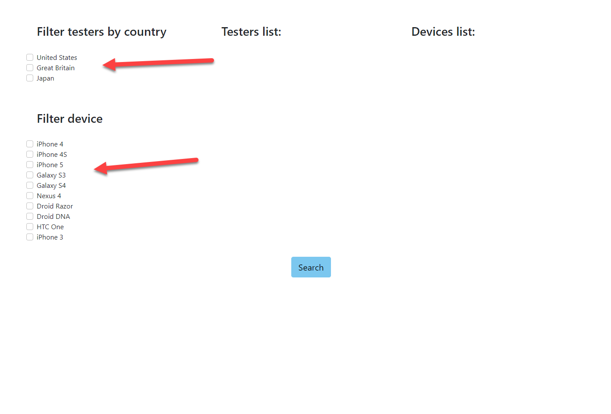
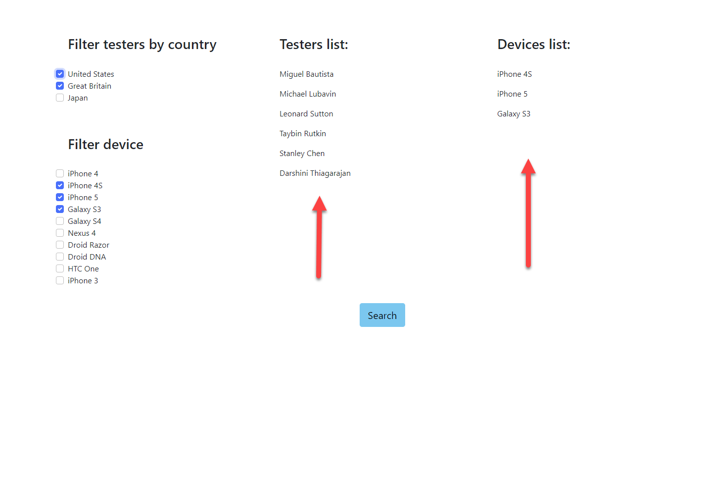
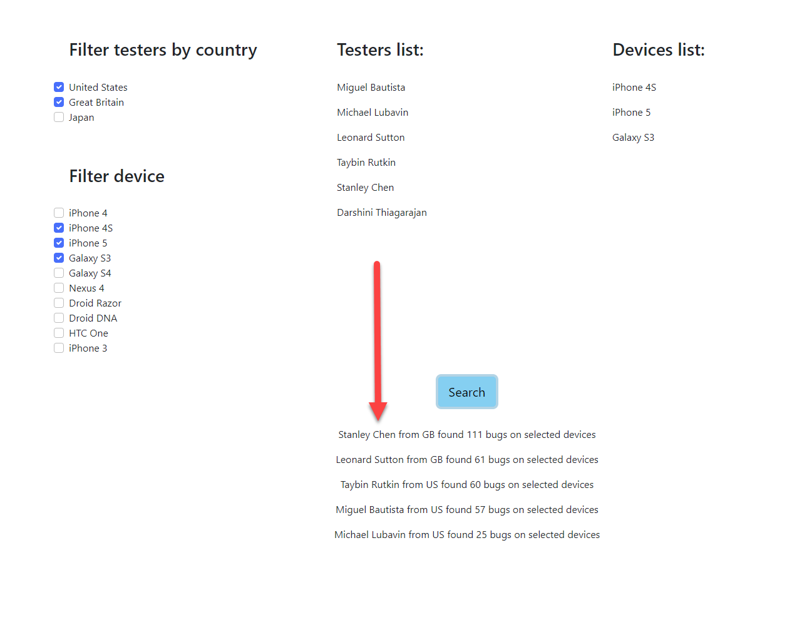

# Applause Backend

### Reference Documentation

### Backend:

Technologies used: Java 8, Spring Boot (Web, JPA), H2 DB, Lombok, Maven

Steps to build and run (need to have Java and Maven installed):

* Backend code is available [here](https://github.com/sadgjl/applause-backend) for download
* run command "mvn clean install" form the root folder
* run "mvn spring-boot:run" to run backend application (need to check port 8080 is not in use)
* alternatively run "java -jar ./target/applause-0.0.1-SNAPSHOT.jar" to run backend

After startup h2 in-memory database will run and access is available at localhost:8080/h2-console/ (username: sa, no pass is needed)
This was implemented to design test application as a real app, where we can quickly change h2 DB to any DB just in properties file.

### Frontend:

Technologies used: Angular, TypeScript, Bootstrap

Steps to build and run (need to have npm and node installed):
* Frontend code is available [here](https://github.com/sadgjl/applause-frontend) for download
* install Angular on your system (skip if installed) by running "npm install -g @angular/cli"
* run "npm i" from the root directory
* run "ng serve" to run frontEnd (need to check port 4200 is not in use)

### Guides

The following guides illustrate how to use some features concretely. Check the countries and devices on your left

Testers from corresponding countries will appear in the middle while selected devices on the right side:

Click Search button when you complete with filters and result will appear below:

This list is sorted by tester experience (bugs). The main calculations were done on the server side (backend)
